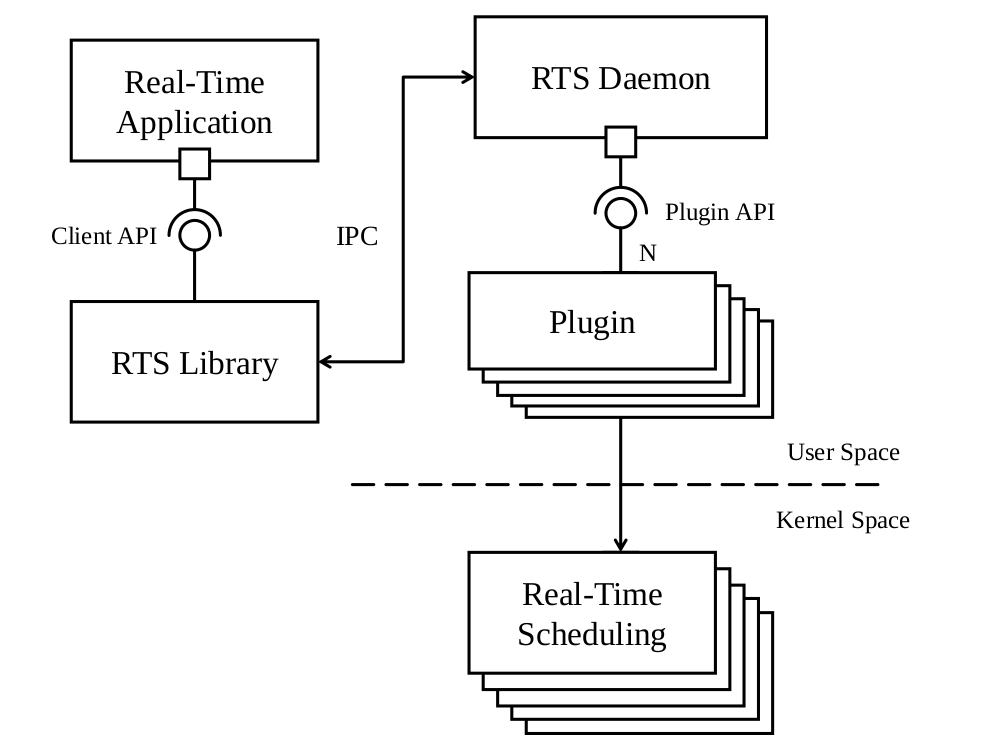

# declarative-linux-realtime-scheduling

A framework for supporting real-time computing on Linux. The tool focuses on improving the usability of real-time capabilities for user applications thinking towards a declarative-reservation paradigm.

## Introduction

The framework represents a tentative to implement a tool, designed with the purpose of supporting real-time computing on Linux, using a declarative approach. A multitude of projects focusing on enriching Linux with proper real-time task scheduling policies already exist, however, this framework represents a quite different tool. The focus is on the possibility to implement at user-level, a tool that meets the requirements posed by complex real-time and multimedia applications, the proper level of abstraction which needs to be exposed at the interface and the difficulty to implement the minimum set of core functionality using what the kernel already offer.

This work was published as a research article during [ISORC 2020](https://isorc.github.io/2020/) conference.
- [Video presentation](https://www.youtube.com/watch?v=9Y0KXTPXL14&)
- [Article (PDF)](https://gabrieleserra.ml/papers/2020/isorc20_declarative_rt_scheduling.pdf)

In the article you can find the basic idea, the theoretical explanation and some rerefences to related work.

## Architecture

The main portion of the entire architecture is the central decision authority, the **ReTiF daemon**. By means of an API provided by the user-library *RTS-Library*, an application can connect to the ReTiF daemon and exploit its services. The RTS-Library then is the primary means that an application has of communicating its real-time requirements to the framework. These requirements are then passed to the RTS Daemon, which in turn communicates requirements to the various *plugins* as needed.



This kind of architecture was designed to support various scheduling algorithms, each implemented by a corresponding plugin. In particular, each plugin associated to a specific scheduling algorithm will analyze the current task set and the requested parameters for the new task and will decide whether to accept it or not into the task set scheduled with that algorithm. In case the plugin embeds an admission criterion, acceptance can depend also on how many CPUs are currently managed by each plugin, which can be customized through the framework configuration file.

## RTS Library APIs

Applications that want to leverage the real-time capabilities provided by the framework will communicate with the RTS Daemon through the shared library *RTS Library*, linked with the application binary. The main functions exposed by the RTS Library are illustrated in table below. In addition, the provided
API contains some utility functions to implement periodic task execution and to query the accepted parameters for each task.

| Function              | Description |
| -------------------   | ------------- |
| `retif_task_create`     | Performs task admission test and applies the specified `retif_params` to the new task.  |
| `retif_task_change`     | Performs a new task admission test with the specified `retif_params`; in case of failure the task maintains its old parameters. |
| `retif_task_release`    | Releases a task, freeing its resources and detaching the attached POSIX thread, if any.  |
| `retif_task_attach`     | Attaches a POSIX thread id to the given task.  |
| `retif_task_detach`     | Detaches the POSIX thread assigned to a task; after this call, the thread runs with a non real-time priority and the task reference can then be attached to another POSIX thread.  |

Applications can declare the scheduling parameters of each real-time task by filling an instance of the opaque type `retif_params`, using the functions described in table below.

| Parameter             | Unit          | Getter / Setter                                               |
| -------------------   | ------------- | ---------------                                               |
| Runtime               | microseconds  |`retif_params_get_runtime` / `retif_params_set_runtime`            |
| Desired Runtime       | microseconds  |`retif_params_get_des_runtime` / `retif_params_set_des_runtime`    |
| Period                | microseconds  |`retif_params_get_period` / `retif_params_set_period`              |
| Relative Deadline     | microseconds  |`retif_params_get_deadline` / `retif_params_set_deadline`          |
| Priority              | -             |`retif_params_get_priority` / `retif_params_set_priority`          |
| Scheduling Plugin     | -             |`retif_params_set_scheduler` / `retif_params_get_scheduler`        |
| Ignore Admission Test | -             |`retif_params_ignore_admission`                                  |

## Getting started

Currently, the only way to get the framework working on your system is to build sources. In future will be provided also binaries.

```
git clone https://github.com/gabriserra/declarative-rtd
cd declarative-rtd
```

Then you need to compile and install the *rtsd* binary, namely the Daemon.

```
cd daemon
make install
```

The Daemon will be installed under `usr/bin` If you want to uninstall the Daemon you can simply `make uninstall` it.
After Daemon has been installed, you have to install also plugins.

```
cd plugins
make install
```

Plugins will be compiled and installed under `usr/share/rtsd`.
In that folder you can find also the `schedconfig.cfg` file, that you can use to configure the loadable plugins and various other settings.

At last, if you want to develop you application relying over the framework, you have to install the **RTS Library**.

```
cd ../../lib
make install
```

Then, you can include in your application ```#include <retif.h>```. You can start developing your application referring to code sample reported below or execute the benchmark written to evaluate RTT latency. In this case

```
cd ../benchmark
make
./benchmark <output.csv>
```

The benchmark folder contains also a `.sh` script that disable frequency scaling and load TSC kernel module in order to estimate latency in accurated way.

## Code sample

The code sample reported below can be used as "first reference".

```c
/* Task representation */
struct retif_task t;

/* Task parameters */
struct retif_params p;

/* Initialize data structures */
retif_task_init(&t);
retif_params_init(&p);

/* Set task parameters with actual param */
retif_param_set_period        (&p, T_PERIOD);
retif_param_set_runtime       (&p, T_RUNTIME);
retif_param_set_des_runtime   (&p, T_DES_RUNTIME);
retif_param_set_deadline      (&p, T_DEADLINE);

/* Test for admission */
if (retif_task_create(&t, &p) != RETIF_OK)
  /* We can abort, or retry with different parameters */
  return;

/* On success we attach an execution flow to the task specification */
retif_task_attach(&t, gettid());

/* Signals that a task begins its execution */
retif_task_start(&t);

while(!computation_ended()) {
  /* Task runs the desired actions*/
  mandatory_computation();

  /* Enabling optional computation depending on the accepted runtime */
  if (retif_task_get_accepted_runtime(&t) > T_RUNTIME)
    optional_computation();

  /* Suspend execution waiting for the next period */
  retif_task_wait_period(&t);
}

/* Cleanup */
retif_task_release(&t);
```

## Plugins

Often, multimedia applications (e.g., sound daemons and CD recording software) use to launch themselves at a statically configured priority, often because the developer don't have information about periodicity or execution time. Furthemore, often temporal parameters provided by tasks are not precise or tasks might need some additional time-budget in particular execution cases. Applications then may exploit more effectively real-time scheduling by declaring their activation period through the RTS-API or leave the system schedule in real-time mode but without any temporal guarantees. Consequently, currently supported plugins are:
- EDF
- RM
- FP
- RR

### Configuration

You can find the configuration in `plugins/schedconfig.cfg`. The configuration file, once modified, must be moved in the library shared folder `usr/share/rtsd`. The `install` target of Makefile will do the work for you.

### EDF

> Requires kernel version greater than 3.14

This plugin implements the EDF scheduling algorithm, which is well known to be optimum for single processor systems. In particular, we implemented a fully-partitioned version of EDF applying a worst-fit task allocation strategy among the CPU cores specified via the RTS Daemon configuration file.
This plugin ensures that the task execution will be suspended in case it overpass the runtime parameter provided. A task could specify a runtime greater that the one required and the daemon dinamycally will decide how much budget provide to the task (the minimum is always guaranteed if accepted).

Stricly required parameters:
- Runtime
- Period

Other parameters:
- Runtime desired
- Deadline

### RM

This plugin implements the Rate Monotonic (RM) scheduling algorithm, which is well known to be optimum for single processor systems among FP scheduling algorithms. In particular, it implements a fully-partitioned version of RM applying a worst-fit task allocation strategy on top of the POSIX `SCHED_FIFO` scheduling policy among the CPU cores specified via the RTS Daemon configuration file. The only required parameter that a real-time task shall declare to be eligible to be scheduled with this plugin is its period.

Stricly required parameters:
- Period

Other parameters:
- Runtime
- Deadline

### FP & RR

The Fixed Priority (FP) and Round Robin (RR) plugins serve as wrappers to expose underlying POSIX functionality to applications that use this framework. They respectively provide access to `SCHED_FIFO` and `SCHED_RR` scheduling policies and as such the only required parameter that shall be specified to
be accepted by either of these plugins is the desired POSIX priority of the task. For this reason, no admission test is performed when submitting a task to these plugins, although a task may still specify other parameters that may be considered by other plugins’ admission tests. Both plugins apply a worst-
fit task allocation strategy, in this case resulting in each new task to be assigned to the CPU core with the least number of assigned tasks.

Stricly required parameters:
- Priority

## Contributors and License

### Contributors

* <b>Gabriele Serra</b>
* <b>Gabriele Ara</b>
* <b>Pietro Fara</b>

The list of contributors can be found in the <a href="https://github.com/gabriserra/declarative-rtd/graphs/contributors">contributors of this project.</a>

> I want to thank Prof. [Tommaso Cucinotta](http://retis.sssup.it/~tommaso/eng/index.html) for his extensive support to the work. Without him, the framework would not exist at all.

### License

The project comes with a GPL 3 license. If you want to use this code, you can do without limitation but you have to document the modifications and include this license. Read more [here](https://choosealicense.com/licenses/gpl-3.0/)

### Citation

If you want to cite, please refer to:

```
@inproceedings{serraetal:20:isorc,
    author =       {Serra, Gabriele and Ara, Gabriele and Fara, Pietro and Cucinotta, Tommaso},
    title =        {An Architecture for Declarative Real-TimeScheduling on Linux},
    year =         {2020}
    keywords =     {real-time, scheduling, declarative, linux},
}
```
